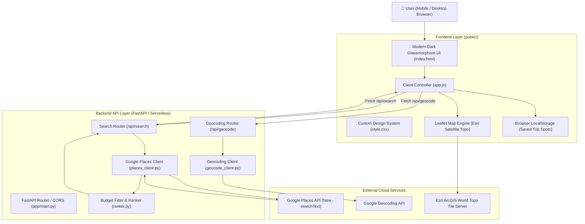
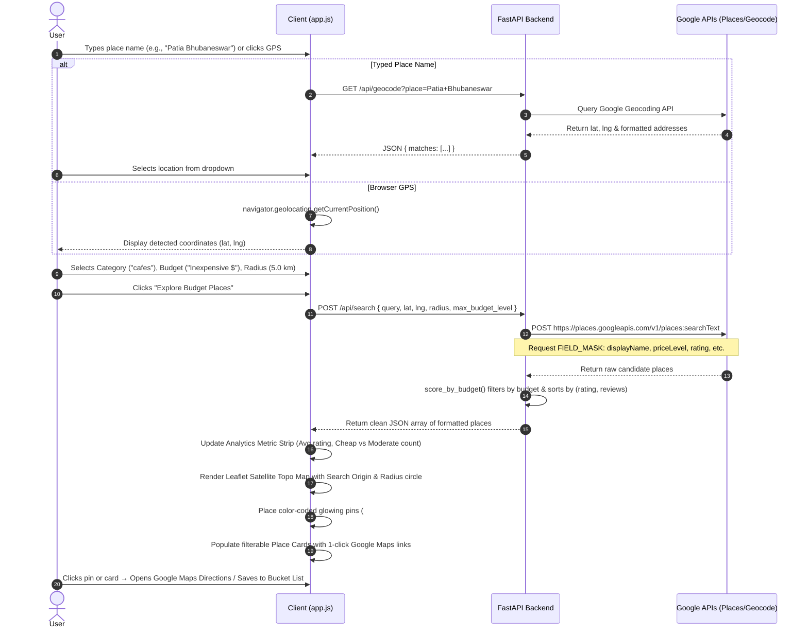

# 📘 Budget Travel AI - Comprehensive Project Documentation

A full-stack, cloud-deployable location intelligence application designed to find high-rated, budget-friendly places (food, stays, cafes, attractions) within custom geographic radiuses using Google Places API (New) and interactive geospatial mapping.

---

## 📑 Table of Contents

1. [Executive Summary](#1-executive-summary)
2. [Key Benefits & Value Proposition](#2-key-benefits--value-proposition)
3. [System Architecture](#3-system-architecture)
4. [End-to-End Workflow](#4-end-to-end-workflow)
5. [Technology Stack](#5-technology-stack)
6. [API Specifications & Data Contracts](#6-api-specifications--data-contracts)
7. [Frontend & Geospatial Experience](#7-frontend--geospatial-experience)
8. [Deployment & Infrastructure](#8-deployment--infrastructure)
9. [Local Development Setup](#9-local-development-setup)
10. [Troubleshooting & Key Engineering Learnings](#10-troubleshooting--key-engineering-learnings)

---

## 1. Executive Summary

Standard navigation tools (like Google Maps or Yelp) prioritize paid advertisements or general popularity, often burying affordable food joints, student-friendly cafes, and budget lodging beneath expensive options. 

**Budget Travel AI** solves this problem by layering automated price-tier normalization and rating-weighted scoring on top of the Google Places API (New). It features an interactive Single-Page Application (SPA) with satellite topographic maps, live GPS detection, custom search boundaries in kilometers, and a session-based Trip Bucket List.

---

## 2. Key Benefits & Value Proposition

- 💰 **Strict Budget Enforcement**: Filter places across 5 precise tiers (`Free`, `Inexpensive $`, `Moderate $$`, `Expensive $$$`, `Very Expensive $$$$`) without misleading listings.
- ⚡ **Zero-Friction Discovery**: Find nearby cheap spots in 1 click using browser GPS or autocompleted landmark/city names.
- 🗺️ **Rich Geospatial Visualization**: View high-contrast Esri Satellite Topographic maps with custom color-coded budget pins (`#1 $`, `#2 $$`) and radius boundary overlays.
- 🧭 **One-Click Turn-by-Turn Directions**: Direct Google Maps deep links on each place card and map popup for instant mobile or desktop navigation.
- 🎒 **Trip Itinerary Bucket List**: Save and organize favorite spots during a session with instant localStorage persistence.
- ☁️ **Serverless & Ultra-Fast**: Built to deploy on Vercel with serverless Python execution and static asset caching for near-instant cold starts.

---

## 3. System Architecture

Budget Travel AI follows a decoupled full-stack architecture consisting of a **Client-Side SPA**, a **FastAPI Serverless Backend**, and **Google Cloud APIs**.



---

## 4. End-to-End Workflow



---

## 5. Technology Stack

| Layer | Technology | Purpose |
|---|---|---|
| **Frontend Structure** | HTML5 (Semantic) | Accessible, lightweight page layout and modals |
| **Frontend Styling** | Vanilla CSS3 | Custom dark glassmorphism design system (`Plus Jakarta Sans` typography, CSS variables, glowing badges) |
| **Frontend Logic** | Vanilla JavaScript (ES6+) | State management, event handling, dynamic filtering, debounce geocoding |
| **Geospatial Mapping** | Leaflet.js 1.9.4 | Interactive canvas map rendering |
| **Map Base Layer** | Esri World Topo Map | High-contrast, watermark-free satellite topographic tiles (No API key required) |
| **Backend Framework** | FastAPI (Python 3.10+) | Asynchronous, high-throughput REST API with Pydantic validation |
| **HTTP Client** | `httpx` / `requests` | Async non-blocking communication with Google Cloud endpoints |
| **External APIs** | Google Places API (New) | Location-based place searches and real-time metadata |
| | Google Geocoding API | Converting human-typed place names into exact geographic coordinates |
| **Hosting & Deployment** | Vercel (`@vercel/python`) | 1-Click Serverless Python execution + edge static file delivery |

---

## 6. API Specifications & Data Contracts

### 1. `POST /api/search`
Searches and returns budget-ranked places around coordinates.

**Request Payload (`application/json`):**
```json
{
  "query": "cafes",
  "lat": 20.3605,
  "lng": 85.8248,
  "radius": 5000,
  "max_budget_level": 2
}
```

**Parameters:**
- `query` *(string)*: Search term (e.g. `restaurant`, `street food`, `budget stays`).
- `lat` *(float)*: Latitude of search center.
- `lng` *(float)*: Longitude of search center.
- `radius` *(integer)*: Search radius in meters (e.g., `5000` for 5.0 km).
- `max_budget_level` *(integer)*: Maximum allowed price tier:
  - `0`: Free only
  - `1`: Inexpensive ($)
  - `2`: Moderate ($$)
  - `3`: Expensive ($$$)
  - `4`: Very Expensive ($$$$)

**Response Payload (`200 OK`):**
```json
{
  "count": 15,
  "results": [
    {
      "id": "places/ChIJQ02qX_1-...",
      "name": "Two Hearts Cafe",
      "address": "Patharagadia, Bhubaneswar, Odisha 751024, India",
      "rating": 4.9,
      "user_rating_count": 1420,
      "price_level": "Inexpensive",
      "price_symbol": "$",
      "price_score": 1,
      "category": "Cafe",
      "open_now": true,
      "google_maps_url": "https://maps.google.com/?cid=...",
      "website_url": "https://twoheartscafe.example.com",
      "location": {
        "latitude": 20.3612,
        "longitude": 85.8239
      }
    }
  ]
}
```

---

### 2. `GET /api/geocode?place={place_name}`
Converts user text input into matching geographic coordinates.

**Query Parameters:**
- `place` *(string)*: e.g. `Agartala`, `Patia`, `Eiffel Tower`.

**Response Payload (`200 OK`):**
```json
{
  "matches": [
    {
      "formatted_address": "Patia, Bhubaneswar, Odisha 751024, India",
      "lat": 20.3605,
      "lng": 85.8248
    }
  ]
}
```

---

### 3. `GET /api/health`
Health check endpoint for uptime monitors and serverless pingers.

**Response (`200 OK`):**
```json
{
  "status": "ok",
  "message": "Budget Travel AI API is running"
}
```

---

## 7. Frontend & Geospatial Experience

### 🗺️ Map Rendering & Custom Visuals
- **Satellite Topographic Tiles**: Uses `https://server.arcgisonline.com/ArcGIS/rest/services/World_Topo_Map/MapServer/tile/{z}/{y}/{x}` for zero-watermark, high-resolution terrain imagery.
- **Search Origin Pin**: Red glowing circular beacon marking the user's exact coordinates.
- **Radius Boundary Circle**: Translucent teal circle (`dashArray: '6, 6'`) visually representing the search range in kilometers.
- **Glowing Price Pins**: Custom HTML markers with ranked badge numbers and budget symbols:
  - 🟢 **Green** (`#10b981`): Free & Inexpensive (`$`)
  - 🟠 **Orange** (`#f59e0b`): Moderate (`$$`)
  - 🔴 **Red** (`#ef4444`): Expensive (`$$$`, `$$$$`)

### 📊 Real-Time Analytics & Secondary Filters
- **Analytics Metric Strip**: Dynamically computes average star rating, total matches, and distribution between cheap vs. moderate spots.
- **Dynamic Category Filter**: Extracts unique categories (e.g. *Cafe, Fast Food, Indian Restaurant*) directly from the results.
- **Multi-Criterion Sort**: Allows switching between *Highest Rated ⭐*, *Most Reviewed 👥*, and *Lowest Budget First 💰*.
- **Open Now Filter**: Toggles live open/closed places in real time.

### 🎒 Persistent Trip Bucket List
- Users can bookmark places using the `🤍 Save` button.
- Saved places are stored in `localStorage` under key `bt_saved_places`.
- Slide-out side drawer displays saved spots with quick directions and export/clear controls.

---

## 8. Deployment & Infrastructure

### 🚀 Deploying to Vercel (1-Click)

The repository is pre-configured with `vercel.json` for hybrid serverless Python + static frontend hosting:

```json
{
  "version": 2,
  "builds": [
    { "src": "app/main.py", "use": "@vercel/python" },
    { "src": "public/**", "use": "@vercel/static" }
  ],
  "routes": [
    { "src": "/api/(.*)", "dest": "app/main.py" },
    { "src": "/static/(.*)", "dest": "public/$1" },
    { "src": "/(.*)", "dest": "public/index.html" }
  ]
}
```

#### Steps:
1. Push code to GitHub:
   ```bash
   git add .
   git commit -m "Deploy to Vercel"
   git push origin main
   ```
2. In [Vercel Dashboard](https://vercel.com/new), import your repository.
3. Add Environment Variable:
   - `GOOGLE_MAPS_API_KEY`: Your Google Cloud Places API key.
4. Click **Deploy**.

---

## 9. Local Development Setup

### Prerequisites
- Python 3.10 or higher
- Active Google Maps API key with **Places API (New)** and **Geocoding API** enabled

### Step-by-Step Setup

```bash
# 1. Clone the repository
git clone https://github.com/ojaspaul123/budget-travel-ai.git
cd budget-travel-ai

# 2. Create virtual environment
python -m venv venv
venv\Scripts\activate       # Windows PowerShell
# source venv/bin/activate  # macOS / Linux

# 3. Install dependencies
pip install -r requirements.txt

# 4. Create environment configuration
echo GOOGLE_MAPS_API_KEY=your_google_maps_api_key_here > .env

# 5. Start the full application (FastAPI serves both API and frontend)
python -m uvicorn app.main:app --reload
```

Open your browser at **`http://127.0.0.1:8000`**.

---

## 10. Troubleshooting & Key Engineering Learnings

| Issue | Root Cause | Engineering Solution |
|---|---|---|
| **Google Places API `400 INVALID_ARGUMENT`** | Passing `PRICE_LEVEL_FREE` or restrictive `priceLevels` in Google API request body. Google Places API (New) does not support filtering by `FREE` in the raw search payload. | Removed `priceLevels` restriction from raw Google request payload. Filter and rank candidates accurately in Python via `ranker.py`. |
| **CartoDB "API KEY REQUIRED" Map Watermarks** | Carto's public positron tile endpoints introduced mandatory referrers / API keys. | Switched default base layer to **Esri Satellite World Topo Map**, which provides high-resolution, watermark-free satellite mapping. |
| **"Unknown Place" / Missing Addresses** | Payload format differences between raw Google response objects (`displayName.text`) and normalized objects (`name`). | Implemented `normalize_place()` in the frontend and backend formatter in `ranker.py` ensuring multi-schema compatibility. |
| **CORS Errors across Domains** | Browser security blocking cross-origin API calls when frontend is hosted separately from backend. | Configured `CORSMiddleware` in `app/main.py` allowing all cross-origin requests (`allow_origins=["*"]`). |
| **Windows PowerShell Command Not Found** | Running `uvicorn` or `streamlit` directly when script folders aren't in system `PATH`. | Standardized all execution commands to `python -m uvicorn ...`. |

---

*Authored for Budget Travel AI • Maintained by ojaspaul123*
